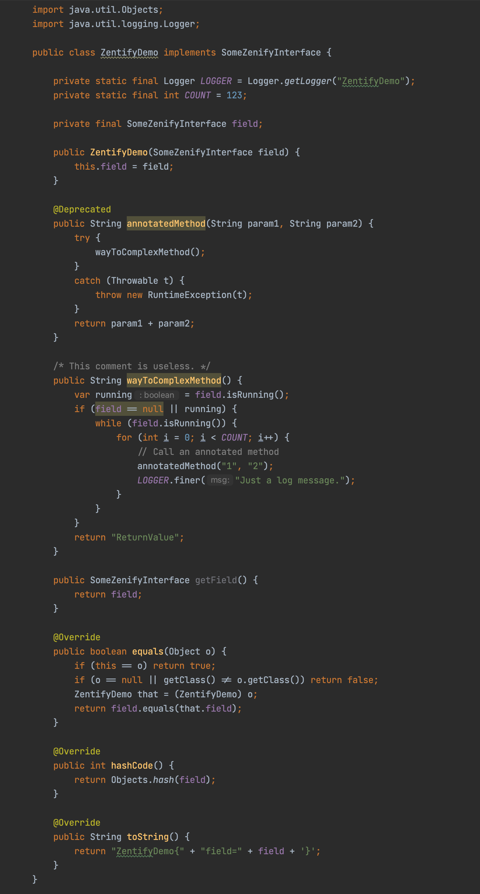
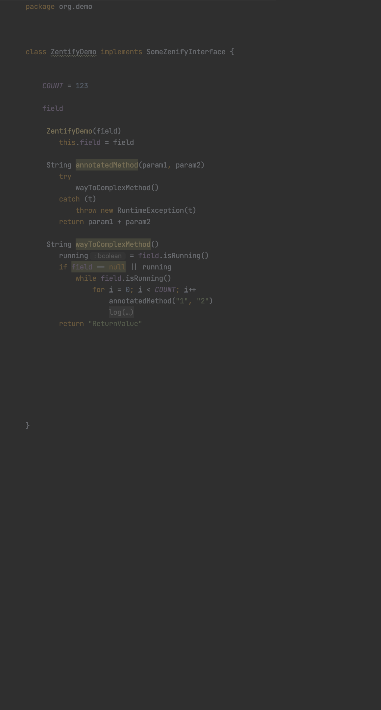
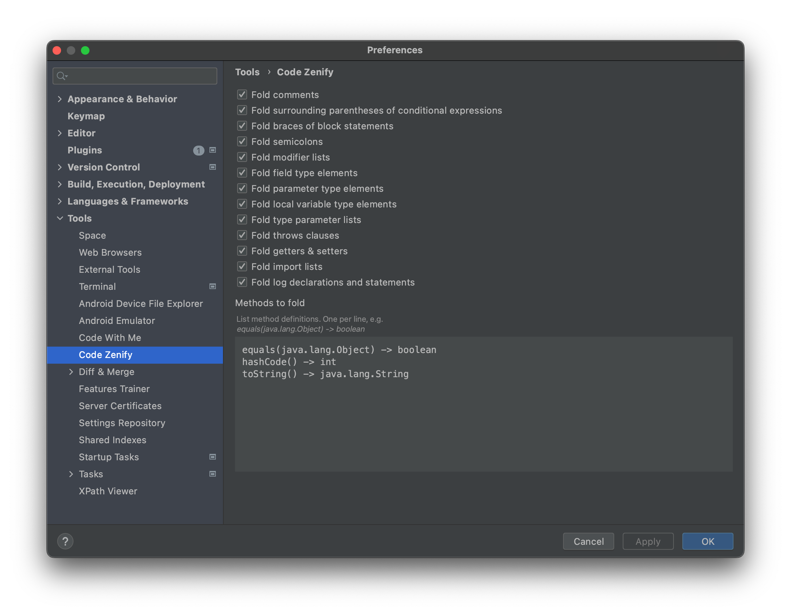

# Code Zenify

<!-- Plugin description -->

# Code Zenify Plugin

This is a IntelliJ IDEA plugin which reduces Java code by all the superfluous rubbish that only disturbs a code review.

| Original source    | Zenified source |
|     |  |
|-----|---------------------------|

There are planty of setting options to customize your zenification experience:

<!-- Plugin description end -->
